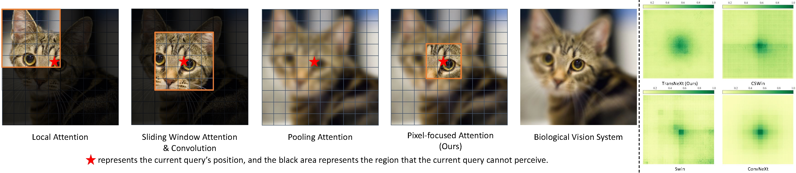
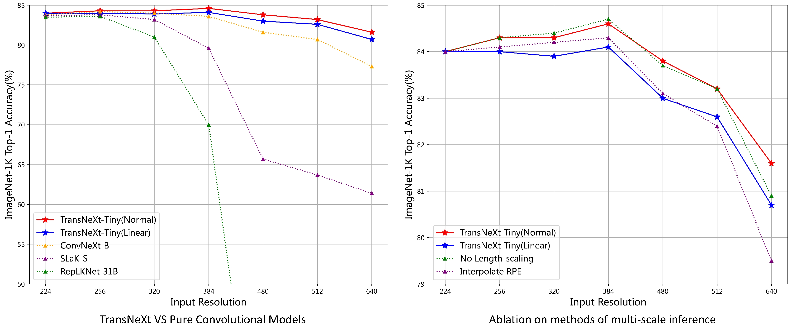
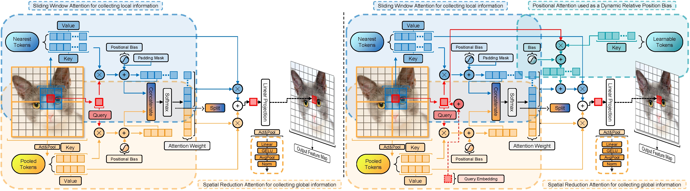
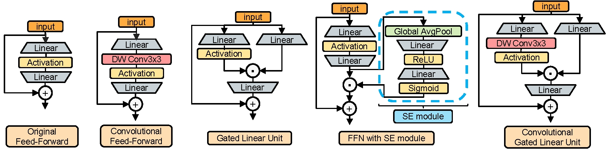
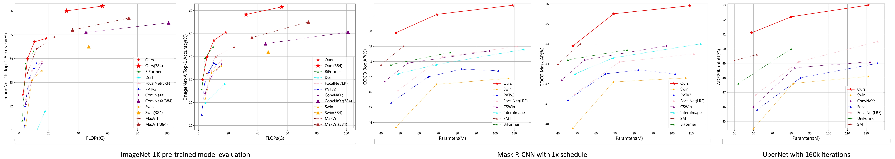
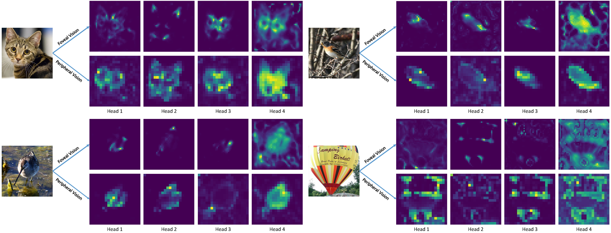

# TransNeXt

Official PyTorch implementation
of ["TransNeXt: Robust Foveal Visual Perception for Vision Transformers"](https://arxiv.org/pdf/2311.17132.pdf) [CVPR 2024]
.

**🤗 Don’t hesitate to give me a ⭐️, if you are interested in this project!**

## Updates

***2024.06.08*** We have created an explanatory video for our paper. You can watch it on [YouTube](https://www.youtube.com/watch?v=MTv3QpNXMU8) or [BiliBili](https://www.bilibili.com/video/BV1693ReyE9F).

***2024.04.20*** We have released the complete training and inference code, pre-trained model weights, and training
logs!

***2024.02.26*** Our paper has been accepted by **CVPR 2024**! 🎉

***2023.11.28*** We have submitted the preprint of our paper to [Arxiv](https://arxiv.org/abs/2311.17132)

***2023.09.21*** We have submitted our paper and the model code to OpenReview, where it is publicly accessible.

## Current Progress
:heavy_check_mark: Release of model code and CUDA implementation for acceleration.

:heavy_check_mark: Release of comprehensive training and inference code. 

:heavy_check_mark: Release of pretrained model weights and training logs.

## Motivation and Highlights
* Our study observes unnatural visual perception (**blocky artifacts**) prevalent in the ERF of many visual backbones. We found that these artifacts, related to the design of their token mixers, are common in
existing efficient ViTs and CNNs, and are difficult to eliminate through deep layer stacking. Our **proposed pixel-focused attention and aggregated attention**, designed through biomimicry, have provided a very effective solution for the artifact phenomenon, achieving natural and smooth visual perception.

    

* Our study reevaluates the conventional belief of superior multi-scale adaptability in CNNs over ViTs. We highlight two key findings: 
    * Existing **large-kernel CNNs** ([RepLKNet](https://github.com/DingXiaoH/RepLKNet-pytorch), [SLaK](https://github.com/VITA-Group/SLaK)) exhibit a **drastic performance degradation** in multi-scale inference. 
    * Our proposed TransNeXt, employing length-scaled cosine attention and extrapolative positional bias, **significantly outperforms** [ConvNeXt](https://github.com/facebookresearch/ConvNeXt) in **largescale image extrapolation**.

    

## Methods
#### Pixel-focused attention (Left) & aggregated attention (Right):

#### Convolutional GLU (First on the right):

## Results

#### Image Classification, Detection and Segmentation:

#### Attention Visualization:

## Model Zoo

### Image Classification

***Classification code & weights & configs & training logs are >>>[here](classification/)<<<.***

**ImageNet-1K 224x224 pre-trained models:**

| Model | #Params | #FLOPs |IN-1K | IN-A | IN-C&#8595; |IN-R|Sketch|IN-V2|Download |Config| Log |
|:---:|:---:|:---:|:---:| :---:|:---:|:---:|:---:| :---:|:---:|:---:|:---:|
| TransNeXt-Micro|12.8M|2.7G| 82.5 | 29.9 | 50.8|45.8|33.0|72.6|[model](https://huggingface.co/DaiShiResearch/transnext-micro-224-1k/resolve/main/transnext_micro_224_1k.pth?download=true) |[config](/classification/configs/transnext_micro.py)|[log](https://huggingface.co/DaiShiResearch/transnext-micro-224-1k/raw/main/transnext_micro_224_1k.txt) |
| TransNeXt-Tiny |28.2M|5.7G| 84.0| 39.9| 46.5|49.6|37.6|73.8|[model](https://huggingface.co/DaiShiResearch/transnext-tiny-224-1k/resolve/main/transnext_tiny_224_1k.pth?download=true)|[config](/classification/configs/transnext_tiny.py)|[log](https://huggingface.co/DaiShiResearch/transnext-tiny-224-1k/raw/main/transnext_tiny_224_1k.txt)|
| TransNeXt-Small |49.7M|10.3G| 84.7| 47.1| 43.9|52.5| 39.7|74.8 |[model](https://huggingface.co/DaiShiResearch/transnext-small-224-1k/resolve/main/transnext_small_224_1k.pth?download=true)|[config](/classification/configs/transnext_small.py)|[log](https://huggingface.co/DaiShiResearch/transnext-small-224-1k/raw/main/transnext_small_224_1k.txt)|
| TransNeXt-Base |89.7M|18.4G| 84.8| 50.6|43.5|53.9|41.4|75.1| [model](https://huggingface.co/DaiShiResearch/transnext-base-224-1k/resolve/main/transnext_base_224_1k.pth?download=true)|[config](/classification/configs/transnext_base.py)|[log](https://huggingface.co/DaiShiResearch/transnext-base-224-1k/raw/main/transnext_base_224_1k.txt)|

**ImageNet-1K 384x384 fine-tuned models:**

| Model | #Params | #FLOPs |IN-1K | IN-A |IN-R|Sketch|IN-V2| Download |Config| 
|:---:|:---:|:---:|:---:| :---:|:---:|:---:| :---:|:---:|:---:|
| TransNeXt-Small |49.7M|32.1G| 86.0| 58.3|56.4|43.2|76.8| [model](https://huggingface.co/DaiShiResearch/transnext-small-384-1k-ft-1k/resolve/main/transnext_small_384_1k_ft_1k.pth?download=true)|[config](/classification/configs/finetune/transnext_small_384_ft.py)|
| TransNeXt-Base |89.7M|56.3G| 86.2| 61.6|57.7|44.7|77.0| [model](https://huggingface.co/DaiShiResearch/transnext-base-384-1k-ft-1k/resolve/main/transnext_base_384_1k_ft_1k.pth?download=true)|[config](/classification/configs/finetune/transnext_base_384_ft.py)|

**ImageNet-1K 256x256 pre-trained model fully utilizing aggregated attention at all stages:**

*(See Table.9 in Appendix D.6 for details)*

| Model |Token mixer| #Params | #FLOPs |IN-1K |Download |Config| Log |
|:---:|:---:|:---:|:---:| :---:|:---:|:---:|:---:|
|TransNeXt-Micro|**A-A-A-A**|13.1M|3.3G| 82.6 |[model](https://huggingface.co/DaiShiResearch/transnext-micro-AAAA-256-1k/resolve/main/transnext_micro_AAAA_256_1k.pth?download=true) |[config](/classification/configs/transnext_micro_AAAA_256.py)|[log](https://huggingface.co/DaiShiResearch/transnext-micro-AAAA-256-1k/blob/main/transnext_micro_AAAA_256_1k.txt) |

### Object Detection
***Object detection code & weights & configs & training logs are >>>[here](detection/)<<<.***

**COCO object detection and instance segmentation results using the Mask R-CNN method:**

| Backbone | Pretrained Model| Lr Schd| box mAP | mask mAP | #Params | Download |Config| Log |
|:---:|:---:|:---:|:---:| :---:|:---:|:---:|:---:|:---:|
| TransNeXt-Tiny | [ImageNet-1K](https://huggingface.co/DaiShiResearch/transnext-tiny-224-1k/resolve/main/transnext_tiny_224_1k.pth?download=true) |1x|49.9|44.6|47.9M|[model](https://huggingface.co/DaiShiResearch/maskrcnn-transnext-tiny-coco/resolve/main/mask_rcnn_transnext_tiny_fpn_1x_coco_in1k.pth?download=true)|[config](/detection/maskrcnn/configs/mask_rcnn_transnext_tiny_fpn_1x_coco.py)|[log](https://huggingface.co/DaiShiResearch/maskrcnn-transnext-tiny-coco/raw/main/mask_rcnn_transnext_tiny_fpn_1x_coco_in1k.log.json)|
| TransNeXt-Small | [ImageNet-1K](https://huggingface.co/DaiShiResearch/transnext-small-224-1k/resolve/main/transnext_small_224_1k.pth?download=true) |1x|51.1|45.5|69.3M|[model](https://huggingface.co/DaiShiResearch/maskrcnn-transnext-small-coco/resolve/main/mask_rcnn_transnext_small_fpn_1x_coco_in1k.pth?download=true)|[config](/detection/maskrcnn/configs/mask_rcnn_transnext_small_fpn_1x_coco.py)|[log](https://huggingface.co/DaiShiResearch/maskrcnn-transnext-small-coco/raw/main/mask_rcnn_transnext_small_fpn_1x_coco_in1k.log.json)|
| TransNeXt-Base | [ImageNet-1K](https://huggingface.co/DaiShiResearch/transnext-base-224-1k/resolve/main/transnext_base_224_1k.pth?download=true) |1x|51.7|45.9|109.2M|[model](https://huggingface.co/DaiShiResearch/maskrcnn-transnext-base-coco/resolve/main/mask_rcnn_transnext_base_fpn_1x_coco_in1k.pth?download=true)|[config](/detection/maskrcnn/configs/mask_rcnn_transnext_base_fpn_1x_coco.py)|[log](https://huggingface.co/DaiShiResearch/maskrcnn-transnext-base-coco/raw/main/mask_rcnn_transnext_base_fpn_1x_coco_in1k.log.json)|
* *When we checked the training logs, we found that the mask mAP and other detailed performance of the Mask R-CNN using the TransNeXt-Tiny backbone were **even better** than reported in the paper (versions V1 and V2). We have already fixed this in version V3  (it should be a data entry error).*

**COCO object detection results using the DINO method:**

| Backbone | Pretrained Model| scales | epochs | box mAP | #Params | Download |Config| Log |
|:---:|:---:|:---:|:---:| :---:|:---:|:---:|:---:|:---:|
| TransNeXt-Tiny | [ImageNet-1K](https://huggingface.co/DaiShiResearch/transnext-tiny-224-1k/resolve/main/transnext_tiny_224_1k.pth?download=true)|4scale | 12|55.1|47.8M|[model](https://huggingface.co/DaiShiResearch/dino-4scale-transnext-tiny-coco/resolve/main/dino_4scale_transnext_tiny_12e_in1k.pth?download=true)|[config](/detection/dino/configs/dino-4scale_transnext_tiny-12e_coco.py)|[log](https://huggingface.co/DaiShiResearch/dino-4scale-transnext-tiny-coco/raw/main/dino_4scale_transnext_tiny_12e_in1k.json)|
| TransNeXt-Tiny | [ImageNet-1K](https://huggingface.co/DaiShiResearch/transnext-tiny-224-1k/resolve/main/transnext_tiny_224_1k.pth?download=true)|5scale | 12|55.7|48.1M|[model](https://huggingface.co/DaiShiResearch/dino-5scale-transnext-tiny-coco/resolve/main/dino_5scale_transnext_tiny_12e_in1k.pth?download=true)|[config](/detection/dino/configs/dino-5scale_transnext_tiny-12e_coco.py)|[log](https://huggingface.co/DaiShiResearch/dino-5scale-transnext-tiny-coco/raw/main/dino_5scale_transnext_tiny_12e_in1k.json)|
| TransNeXt-Small | [ImageNet-1K](https://huggingface.co/DaiShiResearch/transnext-small-224-1k/resolve/main/transnext_small_224_1k.pth?download=true)|5scale | 12|56.6|69.6M|[model](https://huggingface.co/DaiShiResearch/dino-5scale-transnext-small-coco/resolve/main/dino_5scale_transnext_small_12e_in1k.pth?download=true)|[config](/detection/dino/configs/dino-5scale_transnext_small-12e_coco.py)|[log](https://huggingface.co/DaiShiResearch/dino-5scale-transnext-small-coco/raw/main/dino_5scale_transnext_small_12e_in1k.json)|
| TransNeXt-Base | [ImageNet-1K](https://huggingface.co/DaiShiResearch/transnext-base-224-1k/resolve/main/transnext_base_224_1k.pth?download=true)|5scale | 12|57.1|110M|[model](https://huggingface.co/DaiShiResearch/dino-5scale-transnext-base-coco/resolve/main/dino_5scale_transnext_base_12e_in1k.pth?download=true)|[config](/detection/dino/configs/dino-5scale_transnext_base-12e_coco.py)|[log](https://huggingface.co/DaiShiResearch/dino-5scale-transnext-base-coco/raw/main/dino_5scale_transnext_base_12e_in1k.json)|

### Semantic Segmentation
***Semantic segmentation code & weights & configs & training logs are >>>[here](segmentation/)<<<.***

**ADE20K semantic segmentation results using the UPerNet method:**

| Backbone | Pretrained Model| Crop Size |Lr Schd| mIoU|mIoU (ms+flip)| #Params | Download |Config| Log |
|:---:|:---:|:---:|:---:|:---:|:---:|:---:|:---:|:---:|:---:|
| TransNeXt-Tiny | [ImageNet-1K](https://huggingface.co/DaiShiResearch/transnext-tiny-224-1k/resolve/main/transnext_tiny_224_1k.pth?download=true)|512x512|160K|51.1|51.5/51.7|59M|[model](https://huggingface.co/DaiShiResearch/upernet-transnext-tiny-ade/resolve/main/upernet_transnext_tiny_512x512_160k_ade20k_in1k.pth?download=true)|[config](/segmentation/upernet/configs/upernet_transnext_tiny_512x512_160k_ade20k_ss.py)|[log](https://huggingface.co/DaiShiResearch/upernet-transnext-tiny-ade/blob/main/upernet_transnext_tiny_512x512_160k_ade20k_ss.log.json)|
| TransNeXt-Small | [ImageNet-1K](https://huggingface.co/DaiShiResearch/transnext-small-224-1k/resolve/main/transnext_small_224_1k.pth?download=true)|512x512|160K|52.2|52.5/52.8|80M|[model](https://huggingface.co/DaiShiResearch/upernet-transnext-small-ade/resolve/main/upernet_transnext_small_512x512_160k_ade20k_in1k.pth?download=true)|[config](/segmentation/upernet/configs/upernet_transnext_small_512x512_160k_ade20k_ss.py)|[log](https://huggingface.co/DaiShiResearch/upernet-transnext-small-ade/blob/main/upernet_transnext_small_512x512_160k_ade20k_ss.log.json)|
| TransNeXt-Base | [ImageNet-1K](https://huggingface.co/DaiShiResearch/transnext-base-224-1k/resolve/main/transnext_base_224_1k.pth?download=true)|512x512|160K|53.0|53.5/53.7|121M|[model](https://huggingface.co/DaiShiResearch/upernet-transnext-base-ade/resolve/main/upernet_transnext_base_512x512_160k_ade20k_in1k.pth?download=true)|[config](/segmentation/upernet/configs/upernet_transnext_base_512x512_160k_ade20k_ss.py)|[log](https://huggingface.co/DaiShiResearch/upernet-transnext-base-ade/blob/main/upernet_transnext_base_512x512_160k_ade20k_ss.log.json)|
* In the context of multi-scale evaluation, TransNeXt reports test results under two distinct scenarios: **interpolation** and **extrapolation** of relative position bias. 

**ADE20K semantic segmentation results using the Mask2Former method:**

| Backbone | Pretrained Model| Crop Size |Lr Schd| mIoU| #Params | Download |Config| Log |
|:---:|:---:|:---:|:---:|:---:|:---:|:---:|:---:|:---:|
| TransNeXt-Tiny | [ImageNet-1K](https://huggingface.co/DaiShiResearch/transnext-tiny-224-1k/resolve/main/transnext_tiny_224_1k.pth?download=true)|512x512|160K|53.4|47.5M|[model](https://huggingface.co/DaiShiResearch/mask2former-transnext-tiny-ade/resolve/main/mask2former_transnext_tiny_512x512_160k_ade20k_in1k.pth?download=true)|[config](/segmentation/mask2former/configs/mask2former_transnext_tiny_160k_ade20k-512x512.py)|[log](https://huggingface.co/DaiShiResearch/mask2former-transnext-tiny-ade/raw/main/mask2former_transnext_tiny_512x512_160k_ade20k_in1k.json)|
| TransNeXt-Small | [ImageNet-1K](https://huggingface.co/DaiShiResearch/transnext-small-224-1k/resolve/main/transnext_small_224_1k.pth?download=true)|512x512|160K|54.1|69.0M|[model](https://huggingface.co/DaiShiResearch/mask2former-transnext-small-ade/resolve/main/mask2former_transnext_small_512x512_160k_ade20k_in1k.pth?download=true)|[config](/segmentation/mask2former/configs/mask2former_transnext_small_160k_ade20k-512x512.py)|[log](https://huggingface.co/DaiShiResearch/mask2former-transnext-small-ade/raw/main/mask2former_transnext_small_512x512_160k_ade20k_in1k.json)|
| TransNeXt-Base | [ImageNet-1K](https://huggingface.co/DaiShiResearch/transnext-base-224-1k/resolve/main/transnext_base_224_1k.pth?download=true)|512x512|160K|54.7|109M|[model](https://huggingface.co/DaiShiResearch/mask2former-transnext-base-ade/resolve/main/mask2former_transnext_base_512x512_160k_ade20k_in1k.pth?download=true)|[config](/segmentation/mask2former/configs/mask2former_transnext_base_160k_ade20k-512x512.py)|[log](https://huggingface.co/DaiShiResearch/mask2former-transnext-base-ade/raw/main/mask2former_transnext_base_512x512_160k_ade20k_in1k.json)|

## Installation

### CUDA Implementation

Before installing the CUDA extension, please ensure that the CUDA version on your machine (checked with `nvcc -V`)
matches the CUDA version of PyTorch.

    cd swattention_extension
    pip install .

## Acknowledgement
* *This project is built using [timm](https://github.com/huggingface/pytorch-image-models), [MMDetection](https://github.com/open-mmlab/mmdetection), [MMSegmentation](https://github.com/open-mmlab/mmsegmentation) libraries, and [PVT](https://github.com/whai362/PVT), [DeiT](https://github.com/facebookresearch/deit) repositories. We express our heartfelt gratitude for the contributions of these open-source projects.*
* *We also want to express our gratitude for some articles introducing this project and derivative implementations based on this project.*

## License

This project is released under the Apache 2.0 license. Please see the [LICENSE](/LICENSE) file for more information.

## Citation

If you find our work helpful, please consider citing the following bibtex. We would greatly appreciate a star for this
project.

    @InProceedings{shi2023transnext,
      author    = {Dai Shi},
      title     = {TransNeXt: Robust Foveal Visual Perception for Vision Transformers},
      booktitle = {Proceedings of the IEEE/CVF Conference on Computer Vision and Pattern Recognition (CVPR)},
      month     = {June},
      year      = {2024},
      pages     = {17773-17783}
    }
