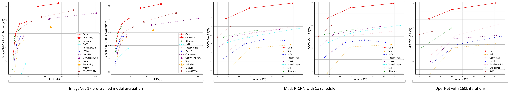

# TransNeXt

Official PyTorch implementation of ["TransNeXt: Robust Foveal Visual Perception for Vision Transformers"](https://arxiv.org/pdf/2311.17132.pdf) [CVPR 2024].

## Updates
***2024.02.26*** Our paper has been accepted by **CVPR 2024**! 🎉

***2023.11.28*** We have submitted the preprint of our paper to [Arxiv](https://arxiv.org/abs/2311.17132)

***2023.09.21*** We have submitted our paper and the model code to OpenReview, where it is publicly accessible.

## Current Progress
:heavy_check_mark: Release of model code and CUDA implementation for acceleration.

## Upcoming releases 

- [ ] Release of comprehensive training and inference code.
- [ ] Release of pretrained model weights.
      
*As the review period has ended, we are preparing to open source the complete code and weights very soon, stay tuned!*

*We greatly appreciate your attention to this project during this pre-release period.*

*We also want to express our gratitude for some articles introducing this project and derivative implementations based on this project.*

## Abstract
Due to the depth degradation effect in residual connections, many efficient Vision Transformers models that rely on stacking layers for information exchange often fail to form sufficient information mixing, leading to unnatural visual perception. To address this issue, in this paper, we propose **Aggregated Attention**, a biomimetic design-based token mixer that simulates biological foveal vision and continuous eye movement while enabling each token on the feature map to have a global perception. Furthermore, we incorporate learnable tokens that interact with conventional queries and keys, which further diversifies the generation of affinity matrices beyond merely relying on the similarity between queries and keys. Our approach does not rely on stacking for information exchange, thus effectively avoiding depth degradation and achieving natural visual perception.
Additionally, we propose **Convolutional GLU**, a channel mixer that bridges the gap between GLU and SE mechanism, which empowers each token to have channel attention based on its nearest neighbor image features, enhancing local modeling capability and model robustness. We combine aggregated attention and convolutional GLU to create a new visual backbone called **TransNeXt**. Extensive experiments demonstrate that our TransNeXt achieves state-of-the-art performance across multiple model sizes. At a resolution of $224^2$, TransNeXt-Tiny attains an ImageNet accuracy of **84.0\%**, surpassing ConvNeXt-B with **69\%** fewer parameters. Our TransNeXt-Base achieves an ImageNet accuracy of **86.2\%** and an ImageNet-A accuracy of **61.6\%** at a resolution of $384^2$, a COCO object detection mAP of **57.1**, and an ADE20K semantic segmentation mIoU of **54.7**.

## Methods
#### Pixel-focused attention (Left) & aggregated attention (Right):

#### Convolutional GLU (First on the right):

## Results
#### Image Classification, Detection and Segmentation:

#### Attention Visualization:

## Installation
### CUDA Implementation
Before installing the CUDA extension, please ensure that the CUDA version on your machine matches the CUDA version of PyTorch. 

    cd swattention_extension
    pip install .

## Citation
If you find our work helpful, please consider citing the following bibtex. We would greatly appreciate a star for this project.

    @misc{shi2023transnext,
      author = {Dai Shi},
      title = {TransNeXt: Robust Foveal Visual Perception for Vision Transformers},
      year = {2023},
      eprint = {arXiv:2311.17132},
      archivePrefix={arXiv},
      primaryClass={cs.CV}
    }
